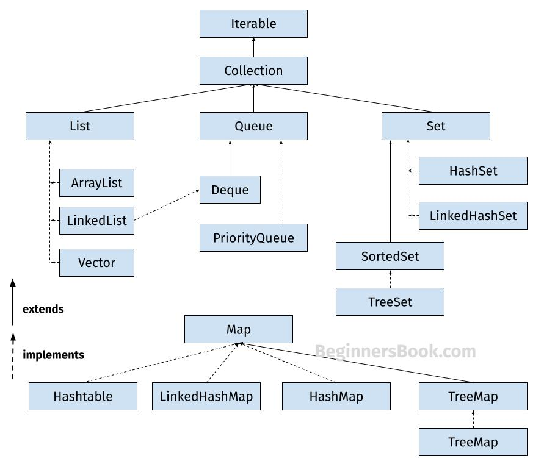
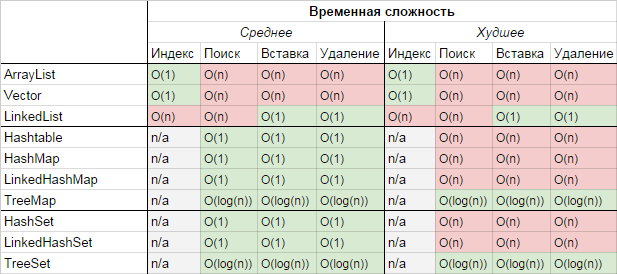

HashMap - хранение данных в виде пар ключ/значение, где у ключей есть хэши, то есть числовые уникальные идентификаторы. Они высчитываются для каждого ключа.  
   
**HashMap vs TreeMap**     
Сходства:
* Реализуют java.util.Map интерфейс.  
* Реализации HashMap а также TreeMap не синхронизированы, Collections.synchronizedSortedMap() - синхронизированный доступ   

Отличия:  
* HashMap использует хеш-таблицу, TreeMap реализовано с помощью красно-черного дерева.  
* Порядок итерации HashMap не определен, тогда как элементы TreeMap упорядочены с использованием их естественного порядка или в соответствии с указанным Компаратором.  
* Сложность методов get, put, containsKey, remove в HashMap O(1), в TreeMap - O(log(n))   
* HashMap допускает нулевые значения и нулевые ключи, тогда как TreeMap разрешает только нулевые значения (не нулевые ключи), если используется естественный порядок ключей. Он поддерживает нулевые ключи только в том случае, если его компаратор поддерживает сравнение нулевых ключей.

- HashMap когда производительность критична, а порядок ключей не имеет значения.  
- TreeMap когда ключи необходимо упорядочить, используя их естественный порядок или с помощью компаратора.  
- LinkedHashMap если порядок вставки ключей должен быть сохранен.  

Деревья:
- Обычное дерево - сколько угодно, любое кол-во наследников
- Бинарное - два наследника, худшая сложность O(n), потому что может стать 'массивом', если все элементы добавляются направо
- Красно-черное дерево - не позволяет стать 'списком'
- B-дерево - O(log n) хранит много ключей в одном узле и ссылается на несколько дочерних узлов. Это уменьшает высоту дерева и, обеспечивает более быстрый доступ к диску.

TreeMap - Бинарный поиск, потому что всегда делим на половину

Synchronized (с англ. "синхронизированный") - это ключевое слово, которое позволяет заблокировать доступ к методу или части кода, если его уже использует другой поток.

2. вопрос с реализацией очереди на двух стенках

**Стек** реализует принцип LIFO (last in — first out, «последним пришёл — первым вышел»).
- push — положить элемент на стек
- pop — достать элемент из стека

**Очередь** — это структура данных с доступом к элементам FIFO (First In, First Out – «первым пришёл — первым ушёл»)
- push — положить элемент в конец очереди
- pop — достать элемент из начала очереди

3. Индексы в БД
Почему нельзя на все поля сразу навесить индексы и чего это стоит
4. B-tree
5. задача про идемпотентность
6. задача про кэширование сессий
   По умолчанию включен кеш первого уровня.
   https://proselyte.net/hibernate-caching-basics/
   Оптимизации работы приложения, уменьшает кол-во обращений к БД
   Обрашаемся к БД
   Сохраняем ответ в кеше
   При следующем запросе получаем данные из кеша

7. volatile - все потоки работают с одним значением